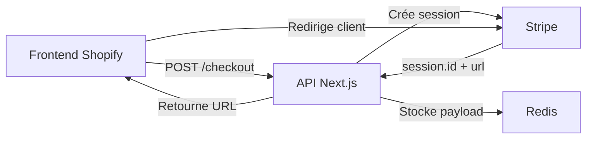
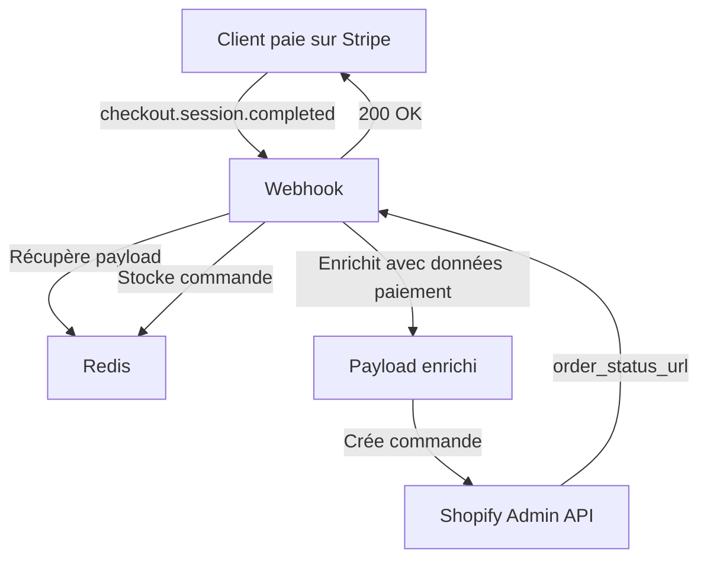
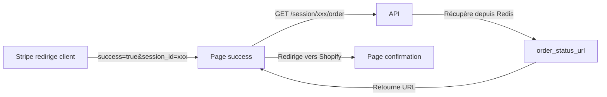

# 🏗️ Architecture - Shopify Bridge Checkout

Documentation technique de l'architecture du bridge Stripe ↔ Shopify.

## 📐 Vue d'ensemble

Le bridge permet de gérer les paiements via Stripe tout en créant automatiquement les commandes dans Shopify. L'architecture est conçue pour être fiable, sécurisée et performante.

## 🔄 Flux de données

### 1. Création de session checkout



**Étapes:**
1. Le frontend envoie les données du panier et du client
2. L'API crée une session Stripe Checkout
3. Le payload de commande Shopify est stocké dans Redis (clé = session.id)
4. Le client est redirigé vers la page de paiement Stripe

### 2. Traitement du paiement



**Étapes:**
1. Stripe envoie un webhook `checkout.session.completed`
2. Le webhook récupère le payload depuis Redis
3. Le payload est enrichi avec les données de paiement Stripe
4. La commande est créée dans Shopify
5. L'URL de confirmation est stockée dans Redis

### 3. Confirmation client



**Étapes:**
1. Stripe redirige le client vers votre page success
2. Le frontend poll l'API pour récupérer l'URL de confirmation
3. Le client est redirigé vers la page de statut Shopify

## 🧱 Composants

### API Routes (Next.js)

#### `/api/v1/stripe/checkout`

**Rôle:** Point d'entrée pour créer une session de paiement.

**Entrées:**
```typescript
{
  cart: ShopifyCart,        // Panier Shopify
  customer: CustomerInfo,   // Infos client
  payload: CheckoutPayload, // Données de commande
  discount?: string         // Code promo optionnel
}
```

**Sorties:**
```typescript
{
  sessionId: string,  // ID session Stripe
  url: string         // URL page paiement Stripe
}
```

**Responsabilités:**
- Valider les données reçues
- Créer les line items Stripe
- Gérer les coupons/remises
- Créer le payload de commande Shopify
- Stocker le payload dans Redis (TTL: 20h)
- Créer la session Stripe Checkout

#### `/api/v1/stripe/webhook`

**Rôle:** Traiter les événements Stripe (paiement complété).

**Entrées:** Événement Stripe signé

**Sorties:** 200 OK / 400-500 Error

**Responsabilités:**
- Vérifier la signature du webhook
- Récupérer le payload depuis Redis
- Enrichir avec données de paiement (méthode, montant, etc.)
- Gérer les clients existants/nouveaux dans Shopify
- Créer la commande dans Shopify Admin API
- Stocker la commande créée dans Redis

#### `/api/v1/session/[sessionId]/order`

**Rôle:** Récupérer l'URL de statut de commande après paiement.

**Entrées:** `sessionId` (param URL)

**Sorties:**
```typescript
{
  order_status_url: string  // URL page confirmation Shopify
}
```

**Responsabilités:**
- Récupérer les données depuis Redis
- Retourner l'URL de statut Shopify

### Services externes

#### Stripe

**Utilisé pour:**
- Créer des sessions Checkout
- Gérer les paiements
- Créer des coupons dynamiques
- Envoyer des webhooks

**APIs utilisées:**
- `checkout.sessions.create()`
- `coupons.create()` / `retrieve()`
- `paymentIntents.retrieve()`
- `paymentMethods.retrieve()`
- `webhooks.constructEvent()`

#### Shopify Admin API

**Utilisé pour:**
- Créer des commandes
- Rechercher des clients existants
- Récupérer des gift cards (optionnel)

**APIs utilisées:**
- `POST /admin/api/2024-01/orders.json`
- `GET /admin/api/2024-10/customers/search.json`
- `GET /admin/api/2023-01/gift_cards/search.json` (optionnel)

#### Redis

**Utilisé pour:**
- Stockage temporaire des payloads de commande
- Cache des commandes créées

**Données stockées:**
- Clé: `session.id` (Stripe)
- Valeur: `JSON.stringify(orderPayload)`
- TTL: 72000 secondes (20h)

**Pourquoi Redis?**
- Le webhook Stripe est asynchrone (délai variable)
- Impossible de passer les données directement
- Redis permet de "ponter" les deux appels API

## 🔐 Sécurité

### Vérification webhook Stripe

```typescript
const event = stripe.webhooks.constructEvent(
  body,           // Raw body
  signature,      // Header Stripe-Signature
  webhookSecret   // STRIPE_WEBHOOK_SECRET
);
```

**Protection contre:**
- Requêtes non-Stripe
- Replay attacks
- Man-in-the-middle attacks

### Variables d'environnement

Toutes les clés sensibles sont stockées en variables d'env:
- `STRIPE_SECRET_KEY`
- `STRIPE_WEBHOOK_SECRET`
- `ADMIN_API_KEY` (Shopify)
- `REDIS_URL`

### CORS

Headers configurés pour autoriser les appels depuis Shopify:
```typescript
Access-Control-Allow-Origin: *
Access-Control-Allow-Methods: GET, POST, PUT, DELETE, OPTIONS
Access-Control-Allow-Headers: Content-Type, Authorization
```

⚠️ **En production:** Limitez `Allow-Origin` à votre domaine.

## 💾 Gestion des données

### Structure du payload Shopify

```typescript
{
  order: {
    email: string,
    contact_email: string,
    total_price: string,        // Format: "99.00"
    cart_token: string,
    token: string,
    source_name: "web_bridge",
    payment_gateway_names: ["stripe"],
    
    // Taxes
    tax_lines: [{
      price: string,
      rate: number,             // 0.2 = 20%
      title: string,
      price_set: {...},
      channel_liable: boolean
    }],
    total_tax: string,
    taxes_included: boolean,
    currency: "EUR",
    
    // Transaction
    transactions: [{
      kind: "sale",
      status: "success",
      amount: string,
      gateway: "stripe",
      authorization: string,    // payment_intent ID
      payment_details: {...}
    }],
    
    // Articles
    line_items: [{
      title: string,
      quantity: number,
      price: string,
      taxable: boolean,
      ...
    }],
    
    // Client
    customer: {
      email: string,
      phone: string,
      first_name: string,
      last_name: string,
      id?: number              // Si client existant
    },
    
    financial_status: "paid",
    tags: ["Stripe Bridge", "v1"],
    note_attributes: [{
      name: string,
      value: string
    }],
    discount_applications?: [...],
  }
}
```

### Mapping Stripe → Shopify

| Donnée Stripe | Champ Shopify | Transformation |
|---------------|---------------|----------------|
| `session.amount_total` | `transactions[0].amount` | Diviser par 100 |
| `session.payment_intent` | `transactions[0].authorization` | Direct |
| `paymentMethod.type` | `payment_gateway_names[]` | Formater ("card" → "Carte bancaire") |
| `paymentMethod.card.last4` | `payment_details.creditCardLastFourDigits` | Direct |
| `paymentMethod.card.brand` | `payment_details.creditCardCompany` | Direct |

## 🧩 Extensibilité

### Ajouter une méthode de paiement

```typescript
// Dans stripe-checkout-route.ts
payment_method_types: ["card", "paypal", "klarna", "alma", "NOUVELLE_METHODE"]
```

```typescript
// Dans stripe-webhook-route.ts (webhook)
switch (paymentMethod.type) {
  case "NOUVELLE_METHODE":
    orderPayload.order.transactions[0].gateway_name = "Nom Affiché";
    break;
}
```

### Ajouter des métadonnées Shopify

```typescript
// Dans createOrderPayload()
orderPayload.order.note_attributes.push({
  name: "Votre Métadonnée",
  value: "Valeur"
});
```

### Personnaliser les tags

```typescript
orderPayload.order.tags = [
  "Stripe Bridge",
  "v1",
  paymentMethod.type,
  customer.tags,
  // Vos tags custom
];
```

## 📊 Monitoring

### Points à surveiller

1. **Taux de succès webhook**
   - Dashboard Stripe → Webhooks → Logs
   - Cible: >99.5%

2. **Latence Redis**
   - Connexion < 100ms
   - Read/Write < 10ms

3. **Erreurs Shopify API**
   - 401: Token invalide
   - 422: Payload mal formé
   - 429: Rate limit (max 4 req/sec)

4. **TTL Redis**
   - Vérifier que 20h est suffisant
   - Augmenter si beaucoup de sessions expirées

### Logs recommandés

```typescript
// En production, utiliser un service type Datadog, Sentry
console.error('Erreur création commande:', {
  sessionId,
  error: error.message,
  payload: orderPayload,
  timestamp: new Date().toISOString()
});
```

## ⚡ Performance

### Optimisations implémentées

1. **Réutilisation des coupons Stripe**
   - Les coupons sont récupérés s'ils existent déjà
   - Évite de créer des doublons

2. **Cache Redis**
   - Évite les appels répétés à Shopify
   - TTL: 20h (ajustable)

3. **Polling côté client**
   - Évite de bloquer le webhook
   - Permet un webhook rapide (< 2s)

### Points d'amélioration possibles

1. **Queue de traitement**
   - Utiliser Bull/BullMQ pour les commandes
   - Gérer les retries automatiquement

2. **Cache des clients Shopify**
   - Réduire les appels `searchCustomer()`
   - Utiliser Redis avec TTL court (5min)

3. **Batching**
   - Grouper plusieurs commandes si volume important
   - Utiliser l'API GraphQL Shopify (plus rapide)

## 🔄 Gestion d'erreurs

### Stratégies implémentées

**Webhook Stripe:**
- Retry automatique par Stripe (3 tentatives)
- Logs détaillés en cas d'échec
- Retourne 500 pour forcer un retry

**Redis:**
- Reconnexion automatique si déconnecté
- Fallback: Continue sans cache (log erreur)

**Shopify API:**
- Gestion des clients existants (phone/email déjà pris)
- Validation du payload avant envoi
- Logs des erreurs 422 avec payload complet

## 📚 Ressources

- [Stripe Webhooks Best Practices](https://stripe.com/docs/webhooks/best-practices)
- [Shopify REST Admin API](https://shopify.dev/docs/api/admin-rest)
- [Redis Best Practices](https://redis.io/docs/manual/patterns/)

---

**Note:** Cette architecture est production-ready mais peut être adaptée selon vos besoins spécifiques.

